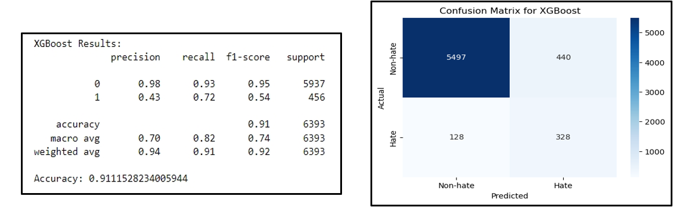

# Advance-NLP-Hate-Speech-detection-using-Transformers-Deep-Learning-

**Project Overview**

This project aims to develop an advanced hate speech detection model using transformer-based deep learning. The model is designed to classify tweets as either hate speech or non-hate speech, promoting safer online interactions and enabling proactive content moderation.

**Motivation**

With the rise of online communication, hate speech has become a significant issue, particularly on platforms like Twitter. This project addresses the need for automated tools to detect hate speech, contributing to more respectful public discourse.

**Data Source**

The dataset used in this project is publicly available on Kaggle. It consists of labeled Twitter data with tweets categorized as hate speech (label: 1) or non-hate speech (label: 0).

[Dataset Link](https://www.kaggle.com/vkrahul/twitter-hate-speech?select=train_E6oV3lV.csv)

**1. Data Preparation and Preprocessing**

**1.1 Data Cleaning**

Key steps included:

- Text Cleaning: Removal of usernames, URLs, special characters, and emojis to standardize the input.

- Tokenization: Applied the BERT tokenizer to transform tweets into token IDs, making them suitable for input into transformer models.

- Class Weighting: To address the class imbalance without artificially generating samples, we applied class weights during model training. This technique assigns a higher weight to the minority class (hate speech) to make the model more sensitive to it, balancing the learning process.

**1.2 Data Visualization**

Exploratory analysis helped us understand data distribution:

- **Class Imbalance Analysis:** Revealed a significant skew, with non-hate speech instances outnumbering hate speech.

 

              

- **Analyzed tweet length distribution:** We also analyzed the distribution of tweet lengths and observed a left-skewed pattern, further indicating the presence of data imbalance.

- **Word Cloud Analysis:** Generated word clouds for each class, highlighting common words associated with hate and non-hate speech.

- **Correlation Analysis:** A low correlation coefficient (0.051) was observed between tweet length and hate speech, indicating that tweet length does not significantly predict the presence of hate speech in the dataset.

**2. Model Building**

The project implemented three models: Transformer (BERT), Logistic Regression, and XGBoost. Each model was trained and evaluated on the processed dataset to determine the best-performing classifier.

- Transformer (BERT): Fine-tuned for binary classification with a custom classifier layer.
  
- Logistic Regression: Served as a traditional baseline model.
  
- XGBoost: Another machine learning model included for comparison.
  
**3. Training and Validation**

Using the Trainer class from the Transformers library, we configured the training with the following parameters:

- Batch Size: 16

- Epochs: 3

- Evaluation Strategy: End-of-epoch validation to monitor training progress.

**4. Model Evaluation and Results**

**4.1 Transformer Model Performance**

The Transformer model demonstrated superior performance with the following metrics:

- Precision: 0.98 for non-hate and 0.79 for hate speech
- Recall: 0.99 for non-hate and 0.71 for hate speech
- Overall Accuracy: 0.97
  

**4.2 Comparison of Models**

The three models were compared based on their precision, recall, F1-scores, and confusion matrices:

- Logistic Regression: Achieved 92% accuracy but struggled with hate speech detection.

XGBoost: Achieved 91% accuracy, with similar limitations in detecting hate speech.

Based on these results, the Transformer model was chosen as the preferred model for the NLP task due to its superior performance and balanced handling of both classes.

**5. Recommendations and Future Work**

To further improve the model’s robustness, we suggest:

- Data Augmentation: Expanding the dataset to include a greater variety of hate speech examples.

- Advanced Fine-tuning: Exploring hyperparameter tuning and learning rate adjustments.

- Ensemble Models: Combining model predictions to improve accuracy.

- Real-time Monitoring: Implementing the model with real-time updates to manage new data.
